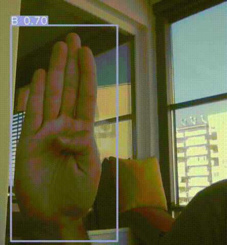

# Real-Time Sign Language Object Detection with YOLOv5s and OpenCV

* This project demonstrates real-time [ASL (American Sign Language)](https://en.wikipedia.org/wiki/American_Sign_Language) object detection using the [pretrained YOLOv5s model from ultralytics](https://github.com/ultralytics/yolov5). The model is trained in the [Google Colab](https://colab.research.google.com/) and on the [ASL dataset from Roboflow by David Lee](https://public.roboflow.com/object-detection/american-sign-language-letters/1) and is capable of detecting various signs in real-time using a webcam feed.

* Training epochs and validation results including mAP50 and mAP50-95 are in the training.ipynb

* 

 
